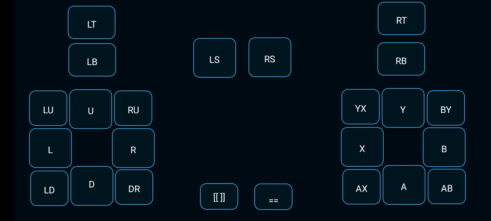

# Monect Layouts for Android     
Monect let's you control your PC/Laptop from your Android Mobile (pretty cool ryt !). All you need is a Remote PC Receiver Software on your PC/Laptop and an android Client app on your Mobile.    

---- 
# Installations
1. Download and install the Monect `PC Remote Reciever` on your Windows PC/Laptop from **[here](https://www.monect.com/#download)**.    
2. Install the Monect `PC Remote` app on your Android Mobile from **[here](https://play.google.com/store/search?q=monect+pc+remote&c=apps&pli=1)**.    

# Setup :    
1. Turn on Mobile hotspot of your PC/Laptop.
2. Turn on wifi of your android Mobile and connect to the wifi of your PC/Laptop.
3. Open the PC Remote Reciever on your PC/laptop and open PC Remote app on your Mobile and click on `connect` option.    
4. Under wifi, select the wifi of your PC/Laptop. My Laptop wifi name is `HP-360AB`.    

      

# Layouts    
## 1. Tekken 7 (Xinput Controller) :   
  
Tekken 7 uses Xinput Controller Layout as shown below 

   

As for the purpose of this repo, We can play Tekken 7 from our android mobile using the layout i developed. download the `Tekken 7.mlo` file and open it using `PC Remote` on your mobile. You will see the layout as follows    

   

Once you have connected android `PC Remote` app to your Laptop, you can use the above layout to control your character.    

***Happy Gaming ... (●'◡'●)***    
----
